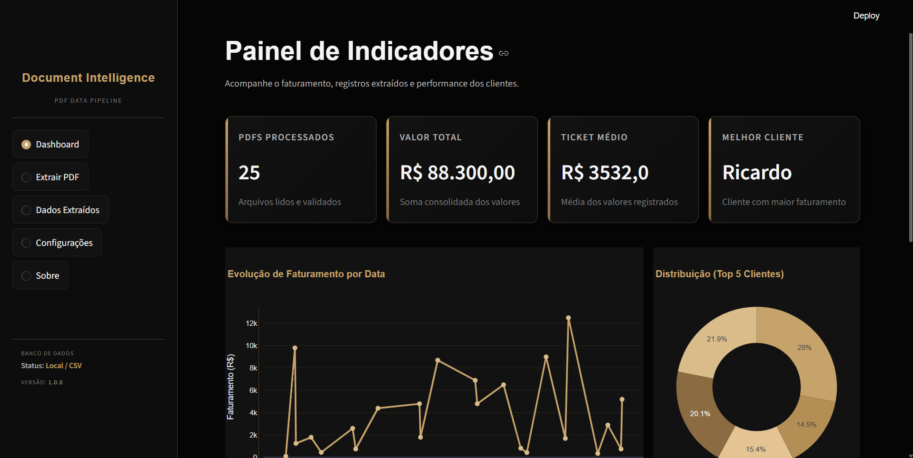
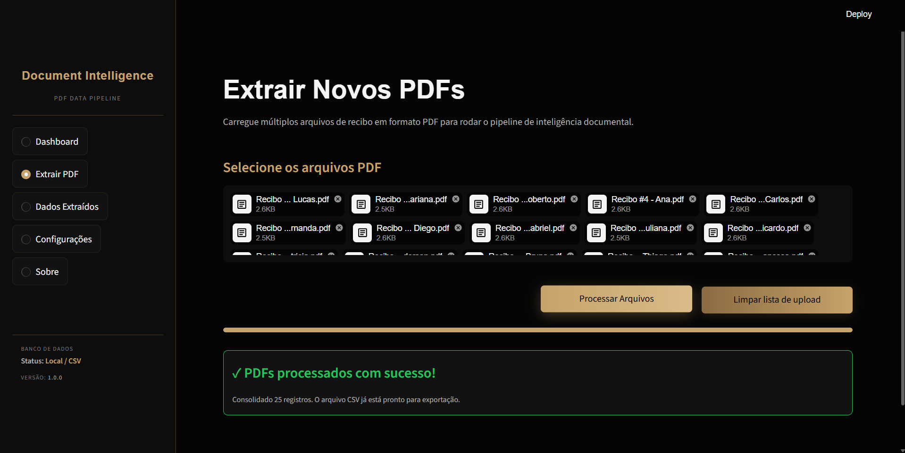
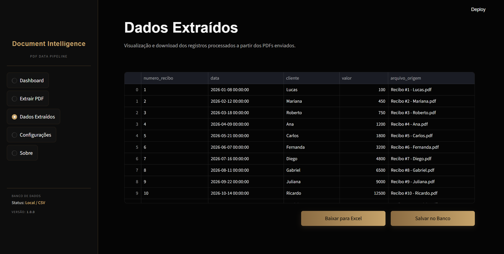
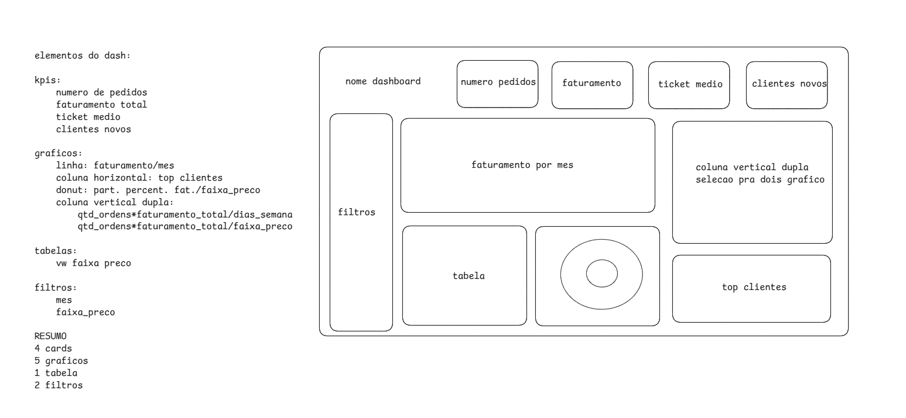
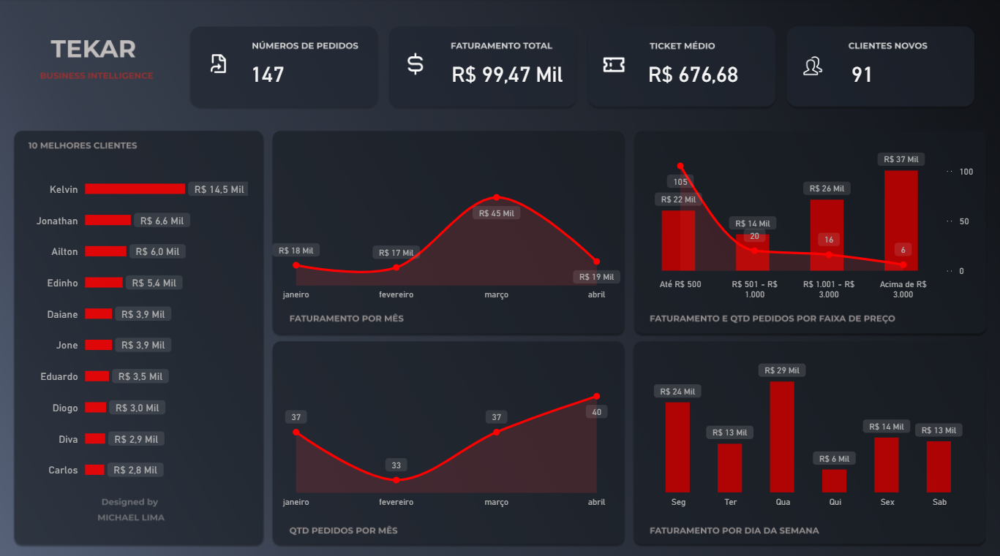

# PDF Intelligence

Automação profissional para extrair dados de recibos em PDF, tratar as informações, armazenar em PostgreSQL e alimentar um dashboard analítico no Power BI.

O projeto atendeu uma demanda real de negócio e reduziu praticamente a zero o tempo manual necessário para consolidar, organizar e analisar recibos.

---

## Objetivo

Transformar recibos em PDF em dados estruturados, consultáveis e prontos para análise.

```text
PDF → Extração → Tratamento → Banco de Dados → Power BI
```

---

## Arquitetura

```text
Usuário
  ↓
Streamlit
  ↓
Upload dos PDFs
  ↓
pdfplumber
  ↓
Regex
  ↓
DataFrame Pandas
  ↓
Tratamento e padronização dos dados
  ↓
Exportação CSV / Excel
  ↓
PostgreSQL
  ↓
Power BI
  ↓
Dashboard Web
```

---

## Tecnologias

* Python
* Streamlit
* pdfplumber
* Regex
* Pandas
* SQLAlchemy
* PostgreSQL
* SQL
* Power BI
* DAX
* Figma
* Excalidraw
* Git/GitHub

---

## Funcionalidades

* Upload múltiplo de PDFs.
* Extração automática de dados dos recibos.
* Tratamento dos dados com Pandas.
* Geração de DataFrame estruturado.
* Exportação para CSV/Excel.
* Envio direto dos dados para PostgreSQL.
* Controle de duplicidade.
* Tratamento de erros.
* Integração com Power BI.
* Dashboard conectado ao banco de dados.
* Base mockada com 25 PDFs para teste.

---

## Dados Extraídos

Principais campos extraídos dos recibos:

```text
numero_recibo
data
cliente
valor
arquivo_origem
data_processamento
```

---

## Indicadores do Dashboard

* Número de pedidos
* Faturamento total
* Ticket médio
* Quantidade de clientes
* Faturamento por mês
* Top clientes
* Análise por faixa de preço
* Participação por faixa de valor
* Evolução temporal do faturamento

---

## Estrutura do Projeto


```text
pdf_etl_platform/
│
├── app.py
├── executar.bat
├── requirements.txt
├── README.md
├── .env
├── .gitignore
│
├── .streamlit/
│   └── config.toml
│
├── data/
│   └── relatorio.csv
│
├── docs/
│   ├── dashboard_streamlit.png
│   ├── exportar_dados.png
│   └── extracao_dados.png
│
├── recibos_mock/
│   └── arquivos PDF para teste
│
├── prompts/
│   └── streamlit.md
│
├── sql/
│   ├── table.sql
│   └── view.sql
│
├── powerbi/
│   ├── dashboard.pbix
│   ├── Tema.json
│   │
│   ├── dax/
│   │   └── medidas DAX documentadas
│   │
│   └── screenshots/
│       ├── DashBoard.png
│       ├── Excalidraw.png
│       └── Figma.png
│
└── src/
    ├── database/
    │   ├── __init__.py
    │   └── connection.py
    │
    ├── extractors/
    │   ├── __init__.py
    │   └── pdf_extractor.py
    │
    └── transformers/
        ├── __init__.py
        └── pedido_transformer.py
```
---

## Screenshots

### 1. Dashboard Streamlit

> Área principal da plataforma Streamlit com visão geral do processamento.



---

### 2. Área de Extração de Dados

> Upload dos PDFs e processamento automático dos recibos.



---

### 3. Área de Exportação de Dados

> Exportação para CSV/Excel e envio direto para PostgreSQL.



---

### 4. Template Power BI

> Plano de fundo criado no Figma para construção visual do dashboard.


---

### 5. Esboço da Arquitetura Visual

> Rascunho do layout e organização dos elementos no Excalidraw.



---

### 6. Dashboard Power BI Final

> Dashboard final conectado ao PostgreSQL e publicado para visualização web.



---

## Fluxo de Uso

```text
1. Usuário envia os PDFs pela interface Streamlit.
2. A aplicação extrai o texto com pdfplumber.
3. Regex captura os campos relevantes.
4. Pandas estrutura e trata os dados.
5. O usuário pode exportar CSV/Excel.
6. O usuário pode enviar os dados ao PostgreSQL.
7. Power BI consome os dados do banco.
8. Dashboard é atualizado com os indicadores.
```

---

## Resultado

O processo manual de consolidação de recibos foi substituído por uma esteira automatizada de dados.

```text
Antes:
PDFs analisados manualmente
Planilhas preenchidas manualmente
Indicadores gerados manualmente

Depois:
Upload dos PDFs
Extração automática
Banco atualizado
Dashboard pronto para análise
```

---

## Destaques Técnicos

* Pipeline ETL funcional.
* Integração entre Python, PostgreSQL e Power BI.
* Automação de uma demanda real de negócio.
* Separação clara entre extração, transformação, carga e visualização.
* Estrutura preparada para expansão com Docker e deploy em nuvem.

---

## Próximas Evoluções

* Dockerização da aplicação.
* Deploy em nuvem.
* Logs estruturados.
* Histórico de processamentos.
* Interface administrativa.
* Agendamento automático de cargas.

---

## Autor

**Michael Lima**
Data Analytics | BI | Python | SQL | Power BI | Automação
